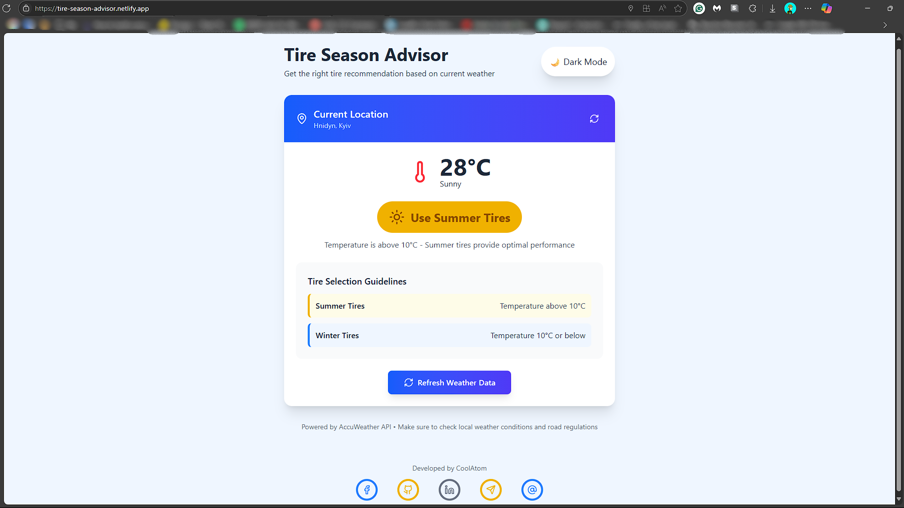

# Tire Season Adviser
**Tire Season Advisor** is a lightweight, responsive web application that provides real-time tire recommendations based on current weather conditions and geolocation. It helps users decide between summer and winter tires by analyzing temperature thresholds and delivering clear, actionable guidance. Powered by React with Tailwind and AccuWeather API.

<div>
     
  
</div>

---

## 🌐 Live Demo

Coming soon — deployable via GitHub Pages, Netlify, or Vercel.

> [!CAUTION]
> **The application must be given permission to determine geolocation**
<div>
  
</div>

---

## 🧩 Tech Stack

| Layer              | Technology Used                     | Purpose                                                                 |
|--------------------|-------------------------------------|-------------------------------------------------------------------------|
| **Frontend**        | React (JSX)                         | Component-based UI, dynamic rendering, and state management             |
| **Styling**         | Tailwind CSS (via CDN)              | Utility-first styling with responsive design and dark mode support      |
| **Icons**           | Lucide React                        | Clean, scalable SVG icons for weather, location, and contact visuals    |
| **Geolocation**     | HTML5 Geolocation API               | Detects user location for weather lookup                                |
| **Weather API**     | AccuWeather API                     | Fetches live weather data and temperature for tire logic                |

---

## ⚙️ Features

- **Live Weather Detection**: Uses browser geolocation to fetch current conditions
- **Tire Logic Engine**: Recommends summer or winter tires based on temperature (10°C cutoff)
- **Dark Mode Toggle**: Manual theme switching with persistent state via `localStorage`
- **Responsive UI**: Mobile-friendly layout with adaptive spacing and icon sizing

---

## 🎨 Styling Strategy

Tailwind CSS is integrated via CDN for rapid prototyping and minimal setup. This approach avoids build tooling while still enabling:

- Responsive layouts (`flex`, `grid`, `gap`, `space-x`);
- Theming via `dark:` options to render light or dark mode;
- Utility classes for spacing, typography, borders, and gradients;
- Shadow settings, loading animation and icons.

---

## 📦 Dependencies

```json
"dependencies": {
    "@testing-library/dom": "^10.4.1",
    "@testing-library/jest-dom": "^6.7.0",
    "@testing-library/react": "^16.3.0",
    "@testing-library/user-event": "^13.5.0",
    "lucide-react": "^0.539.0",
    "react": "^19.1.1",
    "react-dom": "^19.1.1",
    "react-scripts": "5.0.1",
    "web-vitals": "^2.1.4"
  }
